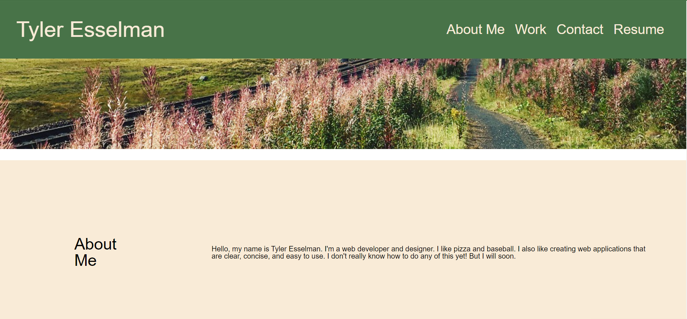
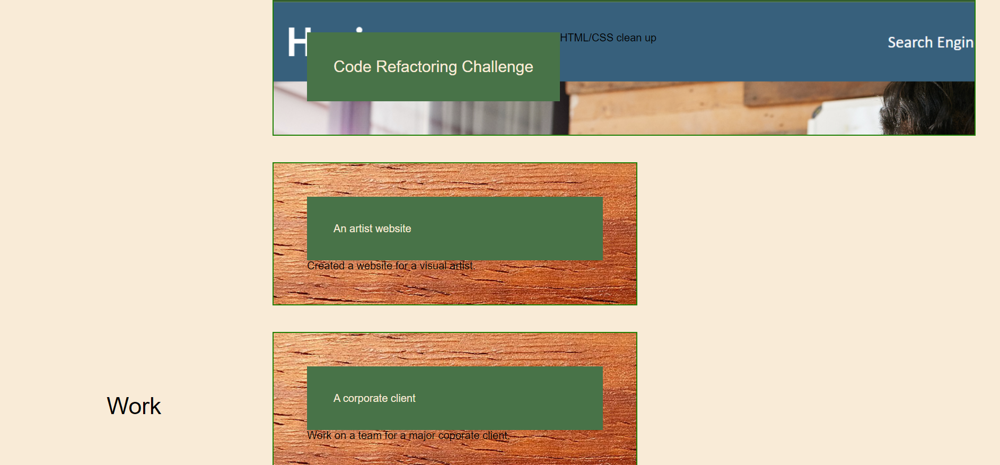
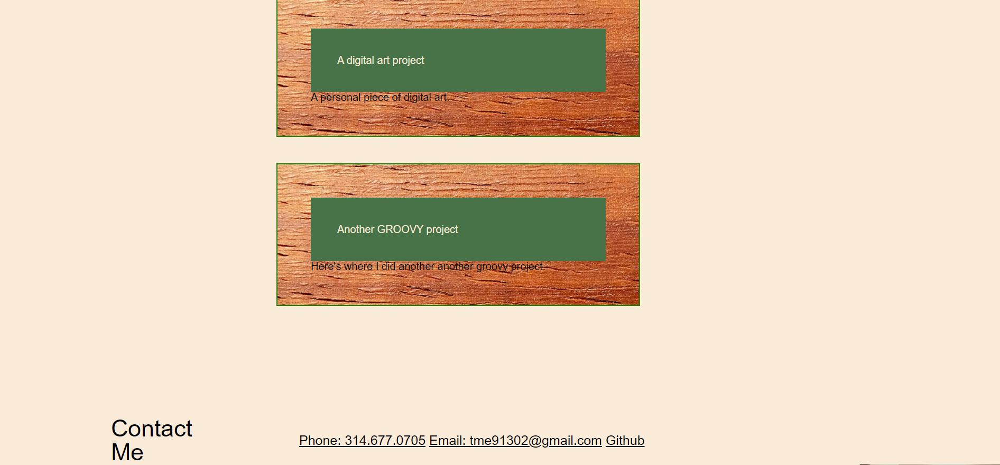

# Portfolio Build Challenge 2

# Description

The brief for this challenge was to create a portfolio webpage for the work I have done and will do over the course of this bootcamp. The core concepts to be implemented were box styling and making them responsive to adjustments in screen size. The word challenge was apt for this assignment. It called upon all of the skills I have  gained so far and stretched them to their limit. I look ofrward to this page being a living document that I will improve and clarify over the course of my bootcamp.

# Live link
[LIVE LINK](https://tyleresselman.github.io/portfolio-build-ch-2/)

# Screenshots of application

